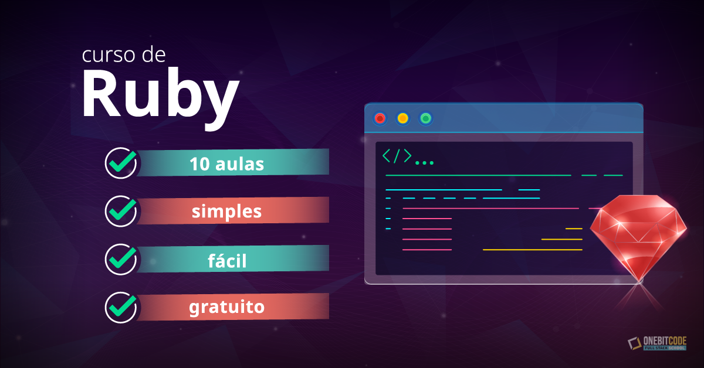

## Curso Ruby Puro OneBitCode
O curso é ministrado pelo professor Leonardo Scorza da [OneBitCode](https://onebitcode.com/lp/) e disponibilizado gratuitamente.

Meu progresso é gerenciado por um [project](https://github.com/users/OsirisMariano/projects/15) referente a este curso e cada issue representa uma aula:
- [x] [Introdução ao Ruby](https://github.com/users/OsirisMariano/projects/15?pane=issue&itemId=25491389) 
- [x] [Conceitos Básicos](https://github.com/users/OsirisMariano/projects/15/views/1?pane=issue&itemId=25491396)
- [x] [Estruturas de Controle](https://github.com/users/OsirisMariano/projects/15?pane=issue&itemId=25491408) 
- [x] [Collections](https://github.com/users/OsirisMariano/projects/15?pane=issue&itemId=25491409)
- [x] [Métodos e Gems](https://github.com/users/OsirisMariano/projects/15?pane=issue&itemId=25491418)
- [x] [Programação Orientada a Objetos I](https://github.com/users/OsirisMariano/projects/15?pane=issue&itemId=25491451)
- [x] [Programação Orientada a Objetos II](https://github.com/users/OsirisMariano/projects/15/views/1?pane=issue&itemId=25491462)
- [x] [Ruby Avançado I](https://github.com/users/OsirisMariano/projects/15/views/1?pane=issue&itemId=25491472)
- [x] [Ruby Avançado II](https://github.com/users/OsirisMariano/projects/15/views/1?pane=issue&itemId=25491482)
- [] [Projeto Final](https://github.com/users/OsirisMariano/projects/15/views/1?pane=issue&itemId=25491488)
